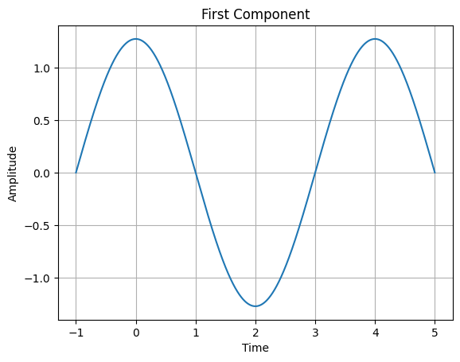
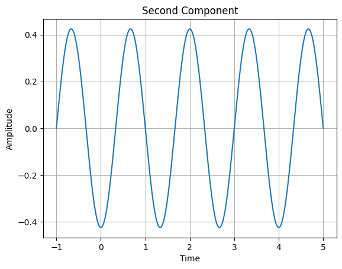
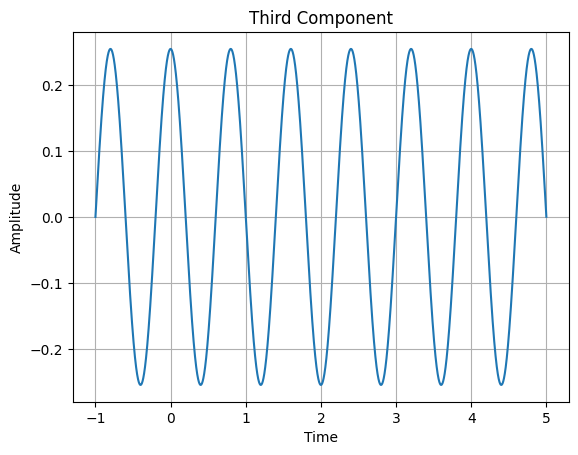
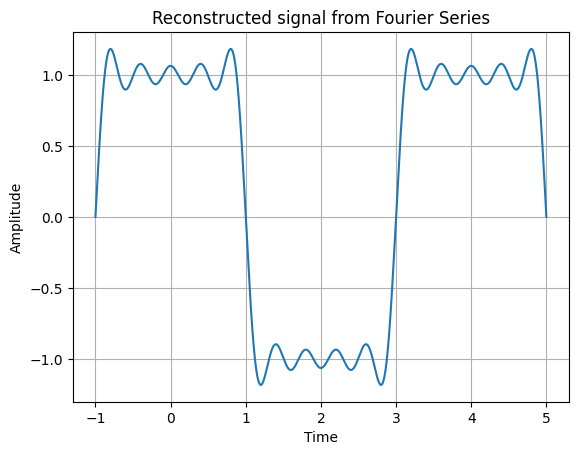
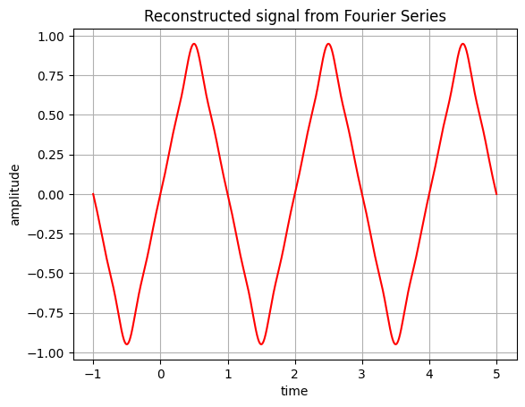
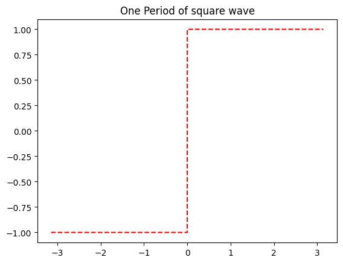
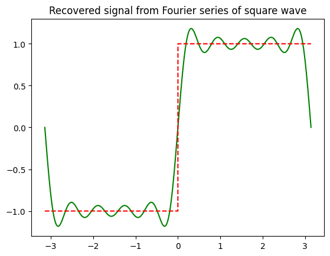
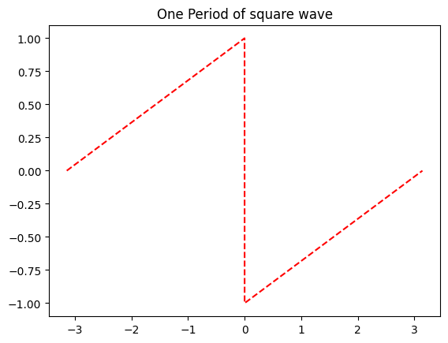
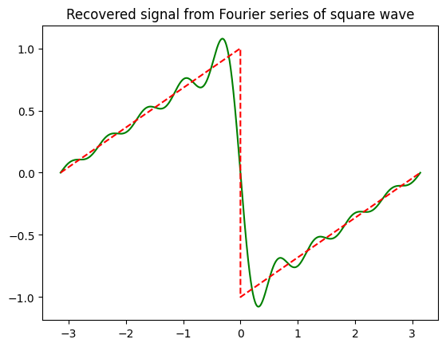

# Fourier Series 
## Aim : To compute Fourier Series coefficients of Square wave form
## Software used  : Python
## IDE : Google Colab

# Completed By
Name : Atul Kumar Dwivedi

Roll Number :11111111

Branch : Electronics and Communication Engineering

Semester : 4

Lab: Signals and Systems (BEC 451)

Date of Completion .....................

### Before writing these codes Students need to calculate coefficients by solving equations of Fourier Series
Basically, what we aim to achieve while using the Fourier Series is to be able to draw the desired drawing by adding up a lot of waves with different oscillations (or) harmonic motions determined by periodic functions. 


```python
import numpy as np
import matplotlib.pyplot as plt 
from math import pi as p 
t=np.arange(-1,5,0.0001)
k=4/p
m=p/2
k1=k*np.cos(m*t)
plt.plot(t,k1)
plt.xlabel('Time') 
plt.ylabel('Amplitude') 
plt.title('First Component') 
plt.grid()
plt.show()
k2=(-k/3)*np.cos(3*m*t)
plt.plot(t,k2)
plt.xlabel('Time') 
plt.ylabel('Amplitude') 
plt.title('Second Component') 
plt.grid()
plt.show()
k3=(k/5)*np.cos(5*m*t)
plt.plot(t,k3)
plt.xlabel('Time') 
plt.ylabel('Amplitude') 
plt.title('Third Component') 
plt.grid()
plt.show()
k4=(-k/7)*np.cos(7*m*t) 
k5=(k/9)*np.cos(9*m*t) 
amplitude=k1+k2+k3+k4+k5 
plt.plot(t, amplitude) 
plt.xlabel('Time') 
plt.ylabel('Amplitude') 
plt.title('Reconstructed signal from Fourier Series') 
plt.grid() 
plt.show
```


    

    


    

    


    

    


    <function matplotlib.pyplot.show(close=None, block=None)>


    

    


## Aim : To compute Fourier Series coefficients of Sawtooth Waveform


```python
import numpy as np
import matplotlib.pyplot as plt 
from math import pi as p 
t=np.arange(-1,5,0.0001)
k=8/(p*p)
k1=k*np.sin(p*t)
k2=(-k/9)*np.sin(3*p*t) 
k3=(k/25)*np.sin(5*p*t) 
k4=(-k/49)*np.sin(7*p*t) 
amplitude=k1+k2+k3+k4
plt.plot(t, amplitude,color='red') 
plt.xlabel('time')
plt.ylabel('amplitude')
plt.title('Reconstructed signal from Fourier Series')
plt.grid() 
plt.show()
```


    

    


```python
import numpy as np

import matplotlib.pyplot as plt

from scipy.signal import square

from scipy.integrate import quad

from math import*  #import all function from math

x=np.arange(-np.pi,np.pi,0.001) #x axis has been chosen from –π to +π, value of 1 smallest square along x axis is 0.001 

y=square(x) #defining square wave function 𝑦 =−1, 𝑓𝑜𝑟 − 𝜋 ≤ 𝑥 ≤ 0
#y= +1, 𝑓𝑜𝑟 0 ≤ 𝑥 ≤ 𝜋
plt.plot(x,y,'r--')
plt.title("One Period of square wave")
plt.show()
#define fuction

fc=lambda x:square(x)*cos(i*x)  #i :dummy index

fs=lambda x:square(x)*sin(i*x)

n=10 #max value of I, not taken infinity, better result with high value

An=[] # defining array

Bn=[]

sum=0

for i in range(n):

 an=quad(fc,-np.pi,np.pi)[0]*(1.0/np.pi)

 An.append(an)

for i in range(n):

 bn=quad(fs,-np.pi,np.pi)[0]*(1.0/np.pi)

 Bn.append(bn) #putting value in array Bn

for i in range(n):
 if i==0.0:
  sum=sum+An[i]/2
 else:
  sum=sum+(An[i]*np.cos(i*x)+Bn[i]*np.sin(i*x))
plt.plot(x,sum,'g')
plt.plot(x,y,'r--')
plt.title("Recovered signal from Fourier series of square wave")
plt.show()
```


    

    


    

    


## Sawtooth


```python
import numpy as np

import matplotlib.pyplot as plt

from scipy.signal import sawtooth

from scipy.integrate import quad

from math import*  #import all function from math

x=np.arange(-np.pi,np.pi,0.001) #x axis has been chosen from –π to +π, value of 1 smallest square along x axis is 0.001 

y=sawtooth(x) #defining square wave function 𝑦 =−1, 𝑓𝑜𝑟 − 𝜋 ≤ 𝑥 ≤ 0
#y= +1, 𝑓𝑜𝑟 0 ≤ 𝑥 ≤ 𝜋
plt.plot(x,y,'r--')
plt.title("One Period of square wave")
plt.show()
#define fuction

fc=lambda x:sawtooth(x)*cos(i*x)  #i :dummy index

fs=lambda x:sawtooth(x)*sin(i*x)

n=10 #max value of I, not taken infinity, better result with high value

An=[] # defining array

Bn=[]

sum=0

for i in range(n):

 an=quad(fc,-np.pi,np.pi)[0]*(1.0/np.pi)

 An.append(an)

for i in range(n):

 bn=quad(fs,-np.pi,np.pi)[0]*(1.0/np.pi)

 Bn.append(bn) #putting value in array Bn

for i in range(n):
 if i==0.0:
  sum=sum+An[i]/2
 else:
  sum=sum+(An[i]*np.cos(i*x)+Bn[i]*np.sin(i*x))
plt.plot(x,sum,'g')
plt.plot(x,y,'r--')
plt.title("Recovered signal from Fourier series of square wave")
plt.show()
```


    

    


    

    

