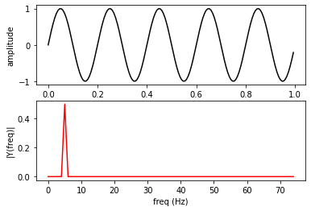
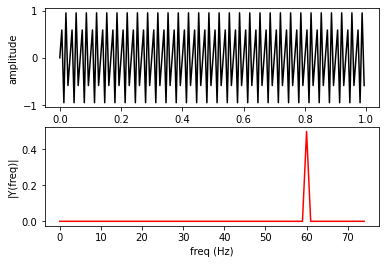
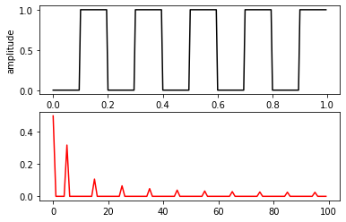
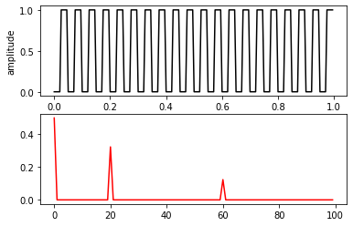
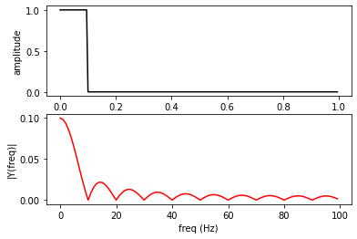

## Aim : To determine Fourier Transform of Basic Signals
## Software used  : Python
## IDE : Google Colab

# Completed By
Name : Atul Kumar Dwivedi

Roll Number :11111111

Branch : Electronics and Communication Engineering

Semester : 4

Lab: Signals and Systems (BEC 451)

Date of Completion 30/03/2024

Spectral analysis is the process of determining the frequency domain representation of a signal in time domain and most commonly employs the Fourier transform. The Discrete Fourier Transform (DFT) is used to determine the frequency content of signals and the Fast Fourier Transform (FFT) is an efficient method for calculating the DFT.Fourier analysis is fundamentally a method:
1.   To express a function as a sum of periodic components.
2.   To recover the function from those components.

"When both the function and its Fourier transform are replaced with discretized counterparts, it is called the discrete Fourier transform (DFT). The DFT has become a mainstay of numerical computing in part because of a very fast algorithm for computing it, called the Fast Fourier Transform (FFT), which was known to Gauss (1805) and was brought to light in its current form by Cooley and Tukey [CT]. Press et al. [NR] provide an accessible introduction to Fourier analysis and its applications."
## 5 Hz sine wave


```python
import numpy as np
import matplotlib.pyplot as plt
from scipy import fft

Fs = 150                         # sampling rate
Ts = 1.0/Fs                      # sampling interval
t = np.arange(0,1,Ts)            # time vector
ff = 5                           # frequency of the signal
y = np.sin(2 * np.pi * ff * t)

plt.subplot(2,1,1)
plt.plot(t,y,'k-')
plt.xlabel('time')
plt.ylabel('amplitude')

plt.subplot(2,1,2)
n = len(y)                       # length of the signal

k = np.arange(n)
T = n/Fs
frq = k/T # two sides frequency range
#n=int(n)
freq = frq[range(n//2)]           # one side frequency range

Y = np.fft.fft(y)/n              # fft computing and normalization
Y = Y[range(n//2)]

plt.plot(freq, abs(Y), 'r-')
plt.xlabel('freq (Hz)')
plt.ylabel('|Y(freq)|')

plt.show()

```


    

    


## 60 Hz sine wave:


```python
import numpy as np
import matplotlib.pyplot as plt
from scipy import fft

Fs = 150                         # sampling rate
Ts = 1.0/Fs                      # sampling interval
t = np.arange(0,1,Ts)            # time vector
ff = 60                           # frequency of the signal
y = np.sin(2 * np.pi * ff * t)

plt.subplot(2,1,1)
plt.plot(t,y,'k-')
plt.xlabel('time')
plt.ylabel('amplitude')

plt.subplot(2,1,2)
n = len(y)                       # length of the signal

k = np.arange(n)
T = n/Fs
frq = k/T # two sides frequency range
#n=int(n)
freq = frq[range(n//2)]           # one side frequency range

Y = np.fft.fft(y)/n              # fft computing and normalization
Y = Y[range(n//2)]

plt.plot(freq, abs(Y), 'r-')
plt.xlabel('freq (Hz)')
plt.ylabel('|Y(freq)|')

plt.show()

```


    

    


## 5 Hz Square wave


```python
import numpy as np
import matplotlib.pyplot as plt
from scipy import fft

Fs = 200                         # sampling rate
Ts = 1.0/Fs                      # sampling interval
t = np.arange(0,1,Ts)            # time vector
ff =5                          # frequency of the signal

zero = np.zeros(10)
zeros = np.zeros(Fs//ff//2)
ones = np.ones(Fs//ff//2)
count = 0
y = []
for i in range(Fs):
    if i % Fs//ff//2 == 0:
        if count % 2 == 0:
            y = np.append(y,zeros)
        else:
            y = np.append(y,ones)
        count += 1

plt.subplot(2,1,1)
plt.plot(t,y,'k-')
plt.xlabel('time')
plt.ylabel('amplitude')

plt.subplot(2,1,2)
n = len(y)                       # length of the signal
k = np.arange(n)
T = n/Fs
frq = k/T # two sides frequency range
freq = frq[range(n//2)]           # one side frequency range

Y = np.fft.fft(y)/n              # fft computing and normalization
Y = Y[range(n//2)]

plt.plot(freq, abs(Y), 'r-')
```


    [<matplotlib.lines.Line2D at 0x7f00cf9ba760>]


    

    


## 20 Hz Square wave


```python
import numpy as np
import matplotlib.pyplot as plt
from scipy import fft

Fs = 200                         # sampling rate
Ts = 1.0/Fs                      # sampling interval
t = np.arange(0,1,Ts)            # time vector
ff = 20                          # frequency of the signal

zero = np.zeros(10)
zeros = np.zeros(Fs//ff//2)
ones = np.ones(Fs//ff//2)
count = 0
y = []
for i in range(Fs):
    if i % Fs//ff//2 == 0:
        if count % 2 == 0:
            y = np.append(y,zeros)
        else:
            y = np.append(y,ones)
        count += 1

plt.subplot(2,1,1)
plt.plot(t,y,'k-')
plt.xlabel('time')
plt.ylabel('amplitude')

plt.subplot(2,1,2)
n = len(y)                       # length of the signal
k = np.arange(n)
T = n/Fs
frq = k/T # two sides frequency range
freq = frq[range(n//2)]           # one side frequency range

Y = np.fft.fft(y)/n              # fft computing and normalization
Y = Y[range(n//2)]

plt.plot(freq, abs(Y), 'r-')
```


    [<matplotlib.lines.Line2D at 0x7f00ce7cf340>]


    

    


## Unit Pulse


```python
import numpy as np
import matplotlib.pyplot as plt
from scipy import fft

Fs = 200                         # sampling rate
Ts = 1.0/Fs                      # sampling interval
t = np.arange(0,1,Ts)            # time vector
ff = 5                           # frequency of the signal

nPulse = 20
y = np.ones(nPulse)
y = np.append(y, np.zeros(Fs-nPulse))

plt.subplot(2,1,1)
plt.plot(t,y,'k-')
plt.xlabel('time')
plt.ylabel('amplitude')

plt.subplot(2,1,2)
n = len(y)                       # length of the signal
k = np.arange(n)
T = n/Fs
frq = k/T # two sides frequency range
freq = frq[range(n//2)]           # one side frequency range

Y = np.fft.fft(y)/n              # fft computing and normalization
Y = Y[range(n//2)]

plt.plot(freq, abs(Y), 'r-')
plt.xlabel('freq (Hz)')
plt.ylabel('|Y(freq)|')

plt.show()
```


    

    


## Random Signal


```python
import numpy as np
import matplotlib.pyplot as plt
from scipy import fft

Fs = 200                         # sampling rate
Ts = 1.0/Fs                      # sampling interval
t = np.arange(0,1,Ts)            # time vector
ff = 5                           # frequency of the signal

y = np.random.randn(Fs)

plt.subplot(2,1,1)
plt.plot(t,y,'k-')
plt.xlabel('time')
plt.ylabel('amplitude')

plt.subplot(2,1,2)
n = len(y)                       # length of the signal
k = np.arange(n)
T = n/Fs
frq = k/T # two sides frequency range
freq = frq[range(n//2)]           # one side frequency range

Y = np.fft.fft(y)/n              # fft computing and normalization
Y = Y[range(n//2)]

plt.plot(freq, abs(Y), 'r-')
plt.xlabel('freq (Hz)')
plt.ylabel('|Y(freq)|')

plt.show()
```


    

    

