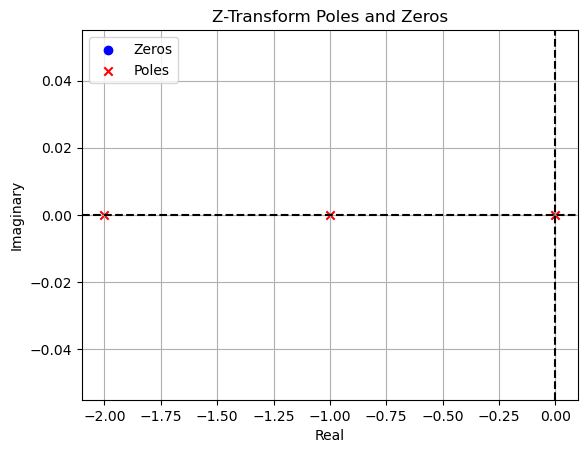

# Lab : Signals and Systems (BEC 451)

## Aim :  To perform Z transform of Signals
 ## Software used  : Python
## IDE : Google Colab
## Completed By
Name :

Roll Number :11111111

Branch : Electronics and Communication Engineering

Semester : 4

Date of Completion ...............................


## Z-transform

The Z-transform is a mathematical tool used to analyze and manipulate discrete-time signals. It is a powerful tool for digital signal processing (DSP) because it allows us to convert a discrete-time signal into a complex frequency-domain representation. This makes it easier to analyze the properties of the signal, such as its frequency content, stability, and causality.

The Z-transform of a discrete-time signal is defined as follows:

X(z) = Σ x[n] z^(-n)

where:

* X(z) is the Z-transform of the signal

* x[n] is the discrete-time signal

* z is a complex variable

* Σ is the summation operator

The Z-transform can be used to perform a variety of operations on discrete-time signals, such as:

* Calculating the frequency response of a filter

* Determining the stability of a system

* Finding the inverse Z-transform of a signal


```python
import numpy as np
import scipy.signal as signal
import matplotlib.pyplot as plt
```


```python
# Discrete-time signal (step function)
n = np.arange(0, 10)
x = np.ones_like(n)
# Calculate the numerator and denominator coefficients of the transfer function
numerator, denominator = signal.zpk2tf([], [0, -1, -2], 1)
# Convert the transfer function coefficients to zeros, poles, and gain representation
zeros, poles, gain = signal.tf2zpk(numerator, denominator)
# Plot the poles and zeros on the complex plane
plt.scatter(np.real(zeros), np.imag(zeros), marker='o', color='blue', label='Zeros')
plt.scatter(np.real(poles), np.imag(poles), marker='x', color='red', label='Poles')
plt.axhline(0, color='black', linestyle='--')
plt.axvline(0, color='black', linestyle='--')
plt.xlabel('Real')
plt.ylabel('Imaginary')
plt.title('Z-Transform Poles and Zeros')
plt.legend()
plt.grid()
plt.show()
```


    

    


Here are some additional code examples and outputs for Z-transforms in Python:

**Example 1:**


```python

import lcapy as lc
from lcapy.discretetime import n

xk=n*2**n*lc.exp(3j*n)
X0=xk.ZT()
print(X0)
```

    2*z*exp(3*j)/(z - 2*exp(3*j))**2
    


```python

```


```python

```
