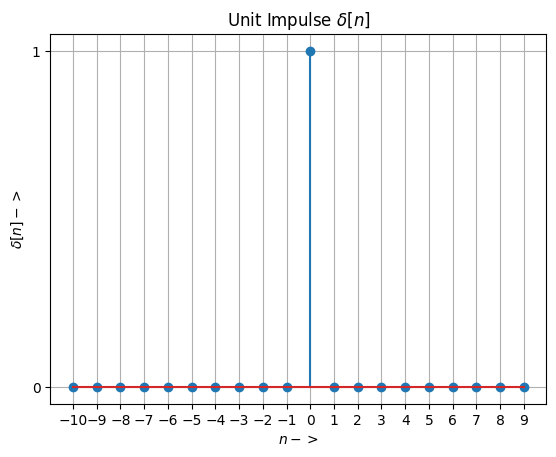
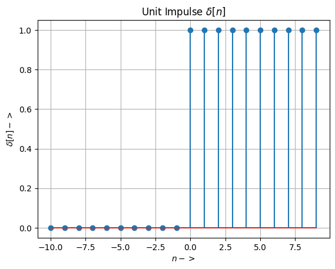
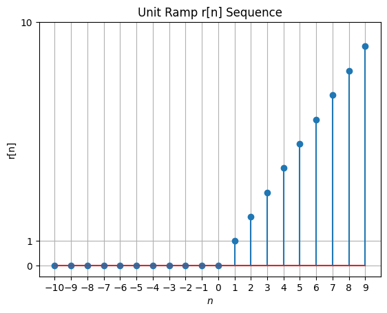

# Lab 2_2 :Signals and systems (BEC 451)
## Course Co-cordinator : Dr. Atul Kumar Dwivedi
## Aim : To generate and visualize Elementry Signals in Discrete time
## Software used  : Python
## IDE : Google Colab 
## Libraries used : Numpy, Matplotlib
### Completed By

**Student Name** : 

**Roll Number** :

Branch : Electronics and Communication Engineering

Semester : 4

Date of Completion .......

### Program 1 : To generate and visualize a descrete time sinusoidal sequence
 $x(t)= 5sinΠ n$ in 0≤n≤2


```python
import numpy as np
import matplotlib.pyplot as plt
n=np.linspace(0,2,50)
x=5*np.sin(np.pi*n);
plt.stem(n,x)
#plt.stem(n,x)
plt.xlabel('$n$')
plt.ylabel('$x(t)$')
plt.ylim((-5,5))
plt.grid()
plt.show()
```


    

    


### Program 2 To generate and visualize discrete time Unit Impulse Sequence


```python
import numpy as np
import matplotlib.pyplot as plt
UL = 10
LL = -10
n = np.arange(LL, UL, 1)
print('n=',n)
myd=[]
myd= np. concatenate((np.zeros(10), np.ones(1),np.zeros(9) ), axis=0)
print('d=',myd)
plt.stem(n, myd)
plt.xlabel('$n->$')
plt.xticks(np.arange(LL, UL, 1))
plt.yticks([0, 1])
plt.ylabel('$\delta[n]->$')
plt.title('Unit Impulse $\delta[n]$')
plt.grid();

```

    n= [-10  -9  -8  -7  -6  -5  -4  -3  -2  -1   0   1   2   3   4   5   6   7
       8   9]
    d= [0. 0. 0. 0. 0. 0. 0. 0. 0. 0. 1. 0. 0. 0. 0. 0. 0. 0. 0. 0.]
    


    

    


### Program 3 To generate and visualize discrete time Unit step sequence


```python
import numpy as np
import matplotlib.pyplot as plt
UL = 10
LL = -10
n = np.arange(LL, UL, 1)
#print('t=',t)
myunit=[]
myunit= np. concatenate((np.zeros(10), np.ones(10) ), axis=0)
#print('u=',myunit)
plt.stem(n, myunit)
plt.xlabel('$n ->$')
#plt.xticks(np.arange(LL, UL, 1))
#plt.yticks([0, 1])
plt.ylabel('$\delta[n]->$')
plt.title('Unit Impulse $\delta[n]$')
plt.grid();
```


    

    


### Program 4 : To generate and visualize discrete time unit ramp sequence

### $r(n)=n$ for n>=0
### $r(n)=0$ for n<0


```python
# Function to generate unit ramp signal r(n)
# r(n)= n for n>= 0, r(n)= 0 otherwise
def unit_ramp(n):
    ramp =[]
    for sample in n:
        if sample<0:
            ramp.append(0)
        else:
            ramp.append(sample)
    return ramp

UL = 10
LL = -10
t = np.arange(LL, UL, 1)
r = unit_ramp(n)
plt.stem(n, r)
plt.xlabel('$n$')
plt.xticks(np.arange(LL, UL, 1))
plt.yticks([0, UL, 1])
plt.ylabel('r[n]')
plt.title('Unit Ramp r[n] Sequence')
#plt.savefig("UnitRamp.png")
plt.grid()

```


    

    


### Program 5 :Exponential Sequence


```python
import numpy as np
import matplotlib.pyplot as plt

N = 21
n = np.arange(0, N+1)  # Total Points (N+1)

xt_grow = 1.5**n  # Growing Sequence
xt_decay = 0.8**n  # Decaying Sequence

plt.subplot(2, 1, 1)
plt.stem(n, xt_grow)
plt.xlabel('n')
plt.ylabel('Growing x(n)')

plt.subplot(2, 1, 2)
plt.stem(n, xt_decay)
plt.xlabel('n')
plt.ylabel('Decaying x(n)')

plt.tight_layout()  # Adjust layout for better spacing
plt.show()

```


    

    


```python

```
