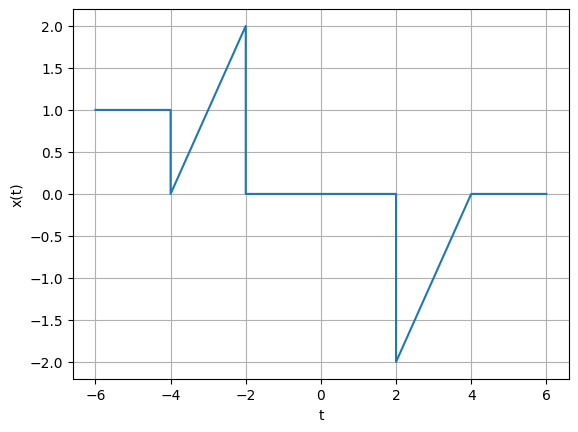

## :Signals and systems (BEC 451)
## Faculty Name : Dr. Atul Kumar Dwivedi
## Aim : To generate and visualize Advanced Signals 
## Software used  : Python
## IDE : Google Colab 
## Libraries used : Numpy, Matplotlib
### Completed By

**Student Name** : 

**Roll Number** :

Branch : Electronics and Communication Engineering

Semester : 4

Date of Completion .......


```python
import numpy as np
import matplotlib.pyplot as plt

   
t1=np.linspace(-6,-4,10)
t2=np.linspace(-4,-2,10)
t3=np.linspace(-2,2,10)
t4=np.linspace(2,4,10)
t5=np.linspace(4,6,10)

x1=t1/t1
x2=t2+4
x3=t3*0
x4=t4-4
x5=t5*0

#x(t)
x=np.concatenate((x1,x2,x3,x4,x5),axis=0)

t=np.concatenate((t1,t2,t3,t4,t5),axis=0)

plt.plot(t,x)

plt.xlabel('t')
plt.ylabel('x(t)')
plt.grid()
plt.show()
```


    

    


### Practice : Write python codes for the signals discussed in lecture below
### <a href="https://youtu.be/C2EJwZGEGf0?si=r_1gQId2pZZ7e8ux" target="_blank">Click to watch Part-01</a>
### <a href="https://youtu.be/3sqIhyXMyBM?si=_MRQAlxEWZT19bZf" target="_blank">Click to watch part-02</a>f


```python

```
