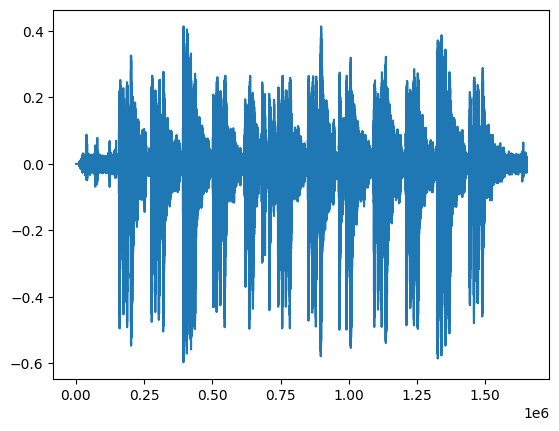
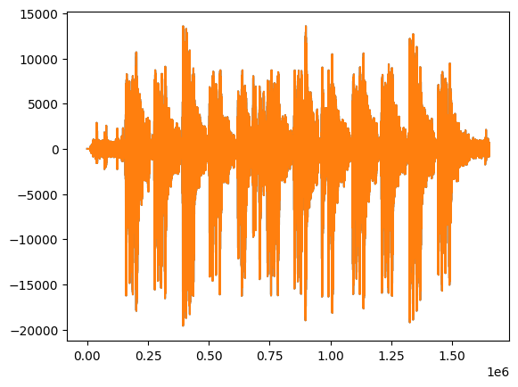

## :Signals and systems (BEC 451)
## Course Co-cordinator : Dr. Atul Kumar Dwivedi
## Aim : To generate and visualize Elementry Signals in Discrete time
## Software used  : Python
## IDE : Google Colab 
## Libraries used : Numpy, Matplotlib
### Completed By

**Student Name** : 

**Roll Number** :

Branch : Electronics and Communication Engineering

Semester : 4

Date of Completion .......


```python
#loading All libraries
from scipy.io import wavfile
import matplotlib.pyplot as plt
import numpy as np

#Mounting Google Drive to read files
#from google.colab import drive
#drive.mount('/content/drive')
#fs, data=wavfile.read('/content/drive/MyDrive/Colab Notebooks/aud1.wav')
fs, data=wavfile.read('aud1.wav')
D=data*1.0/(2**15)
d=D[:,0]
plt.figure(1)
plt.plot(d)
rdata=[]
for i in range (0,1652600):
    rdata.append([data[i+1][0],data[i+1][0]])

data2 = np.asarray(rdata, dtype=np.int16)
plt.figure(2)
plt.plot(data2)
wavfile.write('outout.wav',fs,data2)
#decimation 
```


    

    


    

    


```python

```
