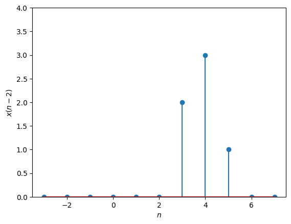
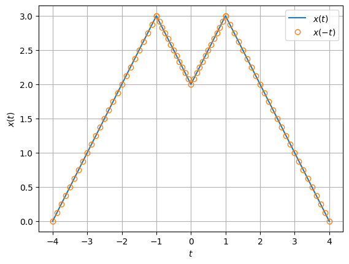
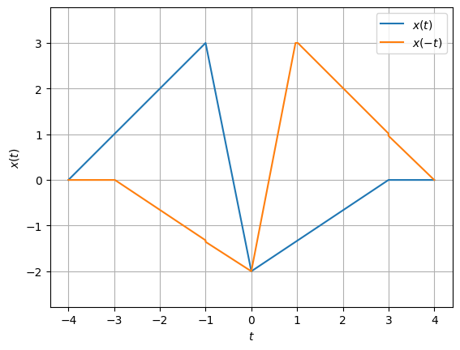
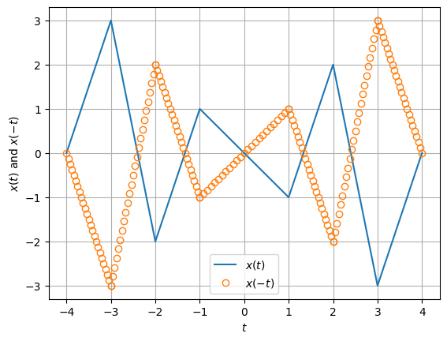
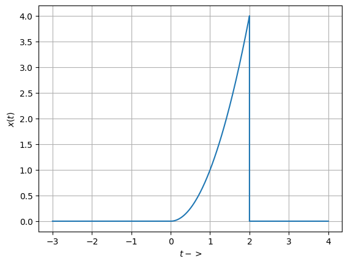
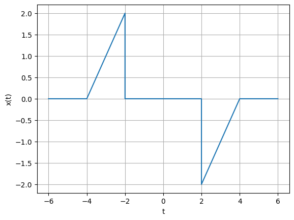
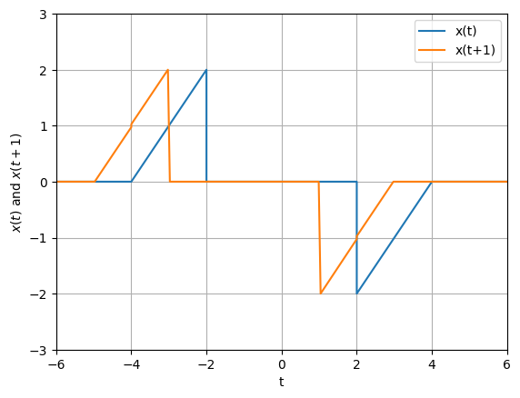
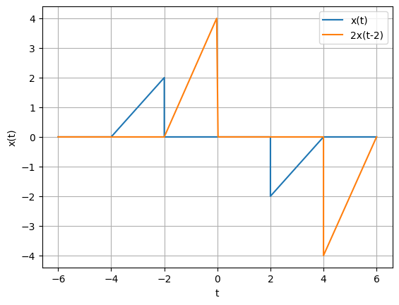
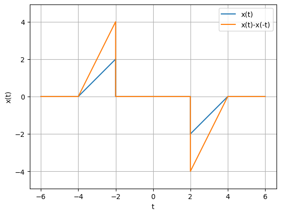

# Lab : Signals and Systems (BEC 451)
## Aim : To perform Advanced Operations on Continuous time Signals
## Software used  : Python
## IDE : Google Colab
## Completed By
Name :

Roll Number :11111111

Branch : Electronics and Communication Engineering

Semester : 4

Date of Completion 


```python
import numpy as np
import matplotlib.pyplot as plt
from scipy.ndimage.interpolation import shift


n=np.linspace(-3,7,11)
#x(n)
xn=np.array([0,0,0,0,2,3,1,0,0,0,0])
#x(n-2)
xn_right=shift(xn, 2, cval=0)

plt.stem(n,xn_right)
plt.xlabel('$n$')
plt.ylabel('$x(n-2)$')
plt.ylim((0,4))
#Ignore the following command
#plt.savefig('../figs/3c.eps')
plt.show()
```

    C:\Users\PD\AppData\Local\Temp\ipykernel_11584\460998647.py:3: DeprecationWarning: Please import `shift` from the `scipy.ndimage` namespace; the `scipy.ndimage.interpolation` namespace is deprecated and will be removed in SciPy 2.0.0.
      from scipy.ndimage.interpolation import shift
    


    

    


```python
import numpy as np
import matplotlib.pyplot as plt

#|t| < 1
t1=np.linspace(-1,1,25)
x1=2+abs(t1)

#1 < |t| < 4 
t2=np.linspace(1,4,25)
x2=-abs(t2)+4
t3=np.linspace(-4,-1,25)
x3=(t3)+4

#x(t)
x=np.concatenate((x3,x1,x2), axis = 0)

t = np.concatenate((t3,t1,t2), axis = 0)

#x(-t)
xflip = np.fliplr([x])[0]


#Plotting
plt.plot(t,x, label='$x(t)$')
plt.plot(t,xflip,'o', mfc='none', label='$x(-t)$')

plt.grid()
plt.xlabel('$t$')
plt.ylabel('$x(t)$')
plt.legend()
##Ignore the following command
#plt.savefig('../figs/4a.eps')
plt.show()
```


    

    


```python
import numpy as np
import matplotlib.pyplot as plt

#-4 < t <-1
t3=np.linspace(-4,-1,60)
x3=t3+4

#-1 < t < 0 
t1=np.linspace(-1,0,20)
x1=-5*t1-2

#0 < t < 3 
t2=np.linspace(0,3,60)
x2=(2.0/3)*(t2-3)

#3 < t <4
t4=np.linspace(3,4,20)
z=np.zeros(20)

#x(t)
x=np.concatenate((x3,x1,x2,z), axis = 0)

t = np.concatenate((t3,t1,t2,t4), axis = 0)

#x(-t)
xflip = np.fliplr([x])[0]

#Plotting
plt.plot(t,x, label='$x(t)$')
plt.plot(t,xflip, label='$x(-t)$')

plt.grid()
plt.xlabel('$t$')
plt.ylabel('$x(t)$')
plt.legend()
plt.axis('equal')
##Ignore the following command
#plt.savefig('../figs/4b.eps')
plt.show()

```


    

    


```python
import numpy as np
import matplotlib.pyplot as plt

#-4 < t < -3
t7=np.linspace(-4,-3,25)
x7=(t7+4)*3

#-3 < t < -2
t5=np.linspace(-3,-2,25)
x5=(-5*t5)-12

# -2 < t < -1
t4=np.linspace(-2,-1,25)
x4=3*(t4)+4

#-1 < t < 1
t1=np.linspace(-1,1,25)
x1=-t1

#1 < t < 2
t2=np.linspace(1,2,25)
x2=3*(t2)-4

#2 < t < 3
t3=np.linspace(2,3,25)
x3=(-5*t3)+12

#3 < t < 4
t6=np.linspace(3,4,25)
x6=(t6-4)*3

#x(t)
x=np.concatenate((x7,x5,x4,x1,x2,x3,x6), axis = 0)

t = np.concatenate((t7,t5,t4,t1,t2,t3,t6), axis = 0)

#x(-t)
xflip =np.fliplr([x])[0]

#Plotting
plt.plot(t,x, label='$x(t)$')
plt.plot(t,xflip,'o', mfc='none', label='$x(-t)$')

plt.grid()
plt.xlabel('$t$')
plt.ylabel('$x(t)$ and $x(-t)$')
plt.legend()
##Ignore the following command
#plt.savefig('../figs/4c.eps')
plt.show()

```


    

    


```python
import numpy as np
import matplotlib.pyplot as plt
from scipy import integrate

t1=np.linspace(-3,0,100)
t2=np.linspace(0,2,100)
t3=np.linspace(2,4,100)

x1=0*np.ones(100)
x2=t2**2
x=np.concatenate((x1,x2,x1),axis=0)
t=np.concatenate((t1,t2,t3),axis=0)

E,err=integrate.quad(lambda t: t**4,0.,2.)
print (E)

plt.plot(t,x)
plt.grid()
plt.xlabel('$t->$')
plt.ylabel('$x(t)$')
plt.show()
```

    6.4
    


    

    


```python
import numpy as np
import matplotlib.pyplot as plt

   
t1=np.linspace(-6,-4,10)
t2=np.linspace(-4,-2,10)
t3=np.linspace(-2,2,10)
t4=np.linspace(2,4,10)
t5=np.linspace(4,6,10)

x1=t1*0
x2=t2+4
x3=t3*0
x4=t4-4
x5=t5*0

#x(t)
x=np.concatenate((x1,x2,x3,x4,x5),axis=0)

t=np.concatenate((t1,t2,t3,t4,t5),axis=0)

plt.plot(t,x)

plt.xlabel('t')
plt.ylabel('x(t)')
plt.grid()
#Ignore the following command
#plt.savefig('../figs/8.eps')
plt.show()
```


    

    


```python
import numpy as np
import matplotlib.pyplot as plt
from scipy.ndimage.interpolation import shift

t1=np.linspace(-6,-4,40)
t2=np.linspace(-4,-2,40)
t3=np.linspace(-2,2,80)
t4=np.linspace(2,4,40)
t5=np.linspace(4,6,40)

x2=t2+4
x3=t3*0
x4=t4-4
x1=t1*0

x=np.concatenate((x1,x2,x3,x4,x1),axis=0)

t=np.concatenate((t1,t2,t3,t4,t5),axis=0)

# 0-1 x(t) has 10 samples i.e., x(t+1)=x(n-20)
andig = 20
anshift = -1

x_t=shift(x,anshift*andig,cval=0)

plt.plot(t,x,label='x(t)')
plt.plot(t,x_t,label='x(t+1)')
plt.xlabel('t')
plt.ylabel('$x(t)$ and $x(t+1)$')
plt.axis([-6,6,-3,3])
plt.grid()
plt.legend()
#Ignore the following command
#plt.savefig('../figs/8a.eps')
plt.show()

```

    C:\Users\PD\AppData\Local\Temp\ipykernel_11584\1400658284.py:3: DeprecationWarning: Please import `shift` from the `scipy.ndimage` namespace; the `scipy.ndimage.interpolation` namespace is deprecated and will be removed in SciPy 2.0.0.
      from scipy.ndimage.interpolation import shift
    


    

    


```python
import numpy as np
import matplotlib.pyplot as plt
from scipy.ndimage.interpolation import shift

t1=np.linspace(-6,-4,40)
t2=np.linspace(-4,-2,40)
t3=np.linspace(-2,2,80)
t4=np.linspace(2,4,40)
t5=np.linspace(4,6,40)

x2=t2+4
x3=t3*0
x4=t4-4
x1=t1*0

x=np.concatenate((x1,x2,x3,x4,x1),axis=0)

t=np.concatenate((t1,t2,t3,t4,t5),axis=0)

# 0-1 x(t) has 20 samples i.e., x(t-1)=x(t-20)
andig = 20
#2x(t-2)
anshift = 2
x_t=shift(2*x,anshift*andig,cval=0)

plt.plot(t,x,label='x(t)')
plt.plot(t,x_t,label='2x(t-2)')
plt.xlabel('t')
plt.ylabel('x(t)')
plt.grid()
plt.legend()
#Ignore the following command
#plt.savefig('../figs/8b.eps')
plt.show()

```

    C:\Users\PD\AppData\Local\Temp\ipykernel_11584\1345193173.py:3: DeprecationWarning: Please import `shift` from the `scipy.ndimage` namespace; the `scipy.ndimage.interpolation` namespace is deprecated and will be removed in SciPy 2.0.0.
      from scipy.ndimage.interpolation import shift
    


    

    


```python
import numpy as np
import matplotlib.pyplot as plt
from scipy.ndimage.interpolation import shift

t1=np.linspace(-6,-4,40)
t2=np.linspace(-4,-2,40)
t3=np.linspace(-2,2,80)
t4=np.linspace(2,4,40)
t5=np.linspace(4,6,40)

x2=t2+4
x3=t3*0
x4=t4-4
x1=t1*0

x=np.concatenate((x1,x2,x3,x4,x1),axis=0)

t=np.concatenate((t1,t2,t3,t4,t5),axis=0)
#x(-t)
x_t=np.fliplr([x])[0]

y=x-x_t
plt.plot(t,x,label='x(t)')
plt.plot(t,y,label='x(t)-x(-t)')
plt.xlabel('t')
plt.ylabel('x(t)')
plt.axis('equal')
plt.grid()
plt.legend()
plt.show()
```

    C:\Users\PD\AppData\Local\Temp\ipykernel_11584\3737533079.py:3: DeprecationWarning: Please import `shift` from the `scipy.ndimage` namespace; the `scipy.ndimage.interpolation` namespace is deprecated and will be removed in SciPy 2.0.0.
      from scipy.ndimage.interpolation import shift
    


    

    

