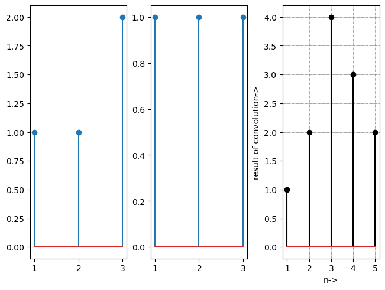

## Aim : To perform convolution of two Signals using python 
## Software used  : Python
## IDE : Google Colab

# Completed By
Name : 

Roll Number :11111111

Branch : Electronics and Communication Engineering

Semester : 4

Lab: Signals and Systems (BEC 451)

Date of Completion 10/03/2024


```python
import numpy as np
import matplotlib.pyplot as plt
```

## Using Step by step approach 


```python
x = [1, 2, 3, 1]
h = [1, 2, 1, -1]

size = len(x) + len(h) - 1

x = np.concatenate([x, np.zeros(len(h))])
h = np.concatenate([h, np.zeros(len(x))])

output = np.zeros(size)

for n in range(size):
    for k in range(n + 1):
        output[n] += x[k] * h[n - k + 1]

# From Lowest Point of h(n) or x(n) to LowestPoint + ConvolutionSize
# -1,0,1,2,3,4,5 (Total Point = ConvSize = 7)

t = np.arange(-1, 6)  # Index of Convolution

plt.stem(t, output)
plt.xlabel('n')
plt.ylabel('y[n]')
plt.title('Convolution Result')
plt.show()
```


    

    


## Using a separate convolution function with strides


```python
def conv1D(x,w, p=0 , s=1): 
  '''
  x : input vector
  w : filter
  p : padding size
  s : stride
  '''
  assert len(w) <= len(x), "x should be bigger than w"
  assert p >= 0, "padding cannot be negative"

  w_r = np.array(w[::-1]) #rotation of w 
  x_padded = np.array(x)

  if p > 0 :
    zeros = np.zeros(shape = p)
    x_padded = np.concatenate([zeros, x_padded, zeros]) #add zeros around original vector

  out = []
  #iterate through the original array s cells per step
  for i in range(0, int((len(x_padded) - len(w_r))) + 1 , s):
    out.append(np.sum(x_padded[i:i + w_r.shape[0]] * w_r)) #formula we have seen before
  return np.array(out)
```

Let’s try running this function on some real data and see the results. Let’s compare the result with NumPy's built-in function that calculates the convolution result automatically.


```python
x = [1,1,2]
w = [1,1,1]
fig, (ax1, ax2, ax3) = plt.subplots(1, 3,constrained_layout = True)
n=[1,2,3]
ax1.stem(n,x)
ax1.set_xticks((1,2,3))
ax1.set_xticklabels(('$1$', '$2$', '$3$'))
ax2.stem(n,w)
ax2.set_xticks((1,2,3))
ax2.set_xticklabels(('$1$', '$2$', '$3$'))
y=conv1D(x,w,2,1)
n=[1,2,3,4,5]
ax3.stem(n,y,"k")
ax3.set_xlabel('n->')
ax3.set_ylabel('result of convolution->')
ax3.set_xticks((1,2,3,4,5))
ax3.set_xticklabels(('$1$', '$2$', '$3$', '$4$', '$5$'))
plt.grid(color='grey', linestyle='-.', linewidth=0.5, axis='both')
print(f'The resultant values are',y)
```

    The resultant values are [1. 2. 4. 3. 2.]
    


    

    


## using built in function


```python
np.convolve(x , w)
```


    array([1, 2, 4, 3, 2])


```python

```
