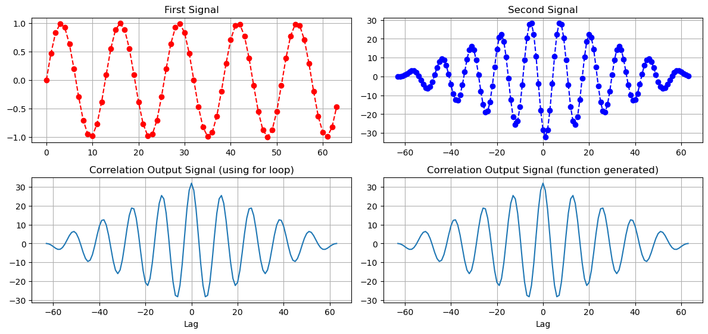
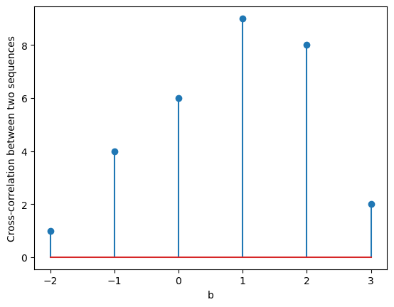
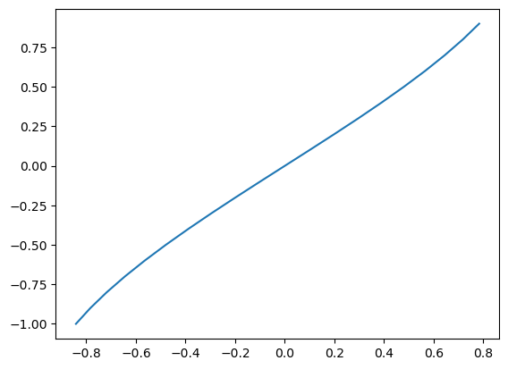

## Aim : To perform Correlation of two Signals using python 
## Software used  : Python
## IDE : Google Colab

# Completed By
Name : 

Roll Number :11111111

Branch : Electronics and Communication Engineering

Semester : 4

Lab: Signals and Systems (BEC 451)

Date of Completion 21/03/2024

## Cross-correlation
Cross-correlation is a basic signal processing method, which is used to analyze the similarity between two signals with different lags. Not only can you get an idea of how well the two signals match with each other, but you also get the point of time or an index, where they are the most similar.


```python
import numpy as np
import matplotlib.pyplot as plt

# Signal-1
fs = 64
tsamp = np.arange(0, 1, 1/fs)
raw_first_signal = np.sin(2 * np.pi * 5 * tsamp)

# Signal-2
fs2 = 64
tsamp2 = np.arange(0, 1, 1/fs2)
raw_second_signal = np.sin(2 * np.pi * 5 * tsamp2)

raw_first_signal_len = len(raw_first_signal)
raw_second_signal_len = len(raw_second_signal)
correlation_size = raw_first_signal_len + raw_second_signal_len - 1

# Making the length of two signals the same
first_signal = np.concatenate([raw_first_signal, np.zeros(raw_second_signal_len)])
second_signal = np.concatenate([raw_second_signal, np.zeros(raw_first_signal_len)])

output_signal = np.zeros(correlation_size)
lag = np.zeros(correlation_size)

size = len(second_signal)
lag_value = -raw_second_signal_len + 1


for i in range(1, raw_first_signal_len + raw_second_signal_len):
    for j in range(1, raw_first_signal_len + 1):
        if i - j + 1 > 0:
            output_signal[i - 1] += first_signal[j - 1] * second_signal[i - j]
        else:
            pass

nx = np.arange(-(raw_second_signal_len - 1), raw_first_signal_len)

# Function-generated Correlation
fun_gen_output_signal, lagg = np.correlate(raw_first_signal, raw_second_signal, mode='full'), np.arange(-(raw_first_signal_len - 1), raw_second_signal_len)

# Plotting...
plt.figure(figsize=(12, 8))

plt.subplot(3, 2, 1)
plt.plot(raw_first_signal, "r--o")
plt.title('First Signal')
plt.grid(True)

plt.subplot(3, 2, 2)
plt.plot(nx,output_signal, "b--o")
plt.title('Second Signal')
plt.grid(True)

plt.subplot(3, 2, 3)
plt.plot(lagg, fun_gen_output_signal)
plt.title('Correlation Output Signal (using for loop)')
plt.xlabel('Lag')
plt.grid(True)

plt.subplot(3, 2, 4)
plt.plot(lagg, fun_gen_output_signal)
plt.title('Correlation Output Signal (function generated)')
plt.xlabel('Lag')
plt.grid(True)

plt.tight_layout()
plt.show()

```


    

    


## Cross-correlation 


```python
import numpy as np
import matplotlib.pyplot as plt

x = np.array([1, 1, 2, 2])
y1 = np.array([1, 3, 1])
y2 = np.flip(y1)

n1 = len(x)
n2 = len(y2)

X = np.concatenate([x, np.zeros(n2)])
Y = np.concatenate([y2, np.zeros(n1)])

y = np.zeros(n1 + n2 - 1)

for i in range(1, n1 + n2):
    for j in range(1, n1 + 1):
        if i - j + 1 > 0:
            y[i - 1] += X[j - 1] * Y[i - j]
        else:
            pass

nx = np.arange(-(len(y1) - 1), len(x))

plt.stem(nx, y)
plt.xlabel('b')
plt.ylabel('Cross-correlation between two sequences')

plt.show()

```


    

    


## Autocoorelation of a discrete time sequence


```python
import numpy as np
import matplotlib.pyplot as plt

x = np.array([1, 2, 1, 1])
x1 = np.flip(x)

n = len(x)
X = np.concatenate([x, np.zeros(n)])
flip_x = np.concatenate([x1, np.zeros(n)])
y = np.zeros(2 * n - 1)

for i in range(1, 2 * n):
    for j in range(1, n + 1):
        if i - j + 1 > 0:
            y[i - 1] += X[j - 1] * flip_x[i - j]
        else:
            pass

# Plotting...
plt.subplot(2, 1, 1)
plt.stem(x)
plt.xlabel('a')
plt.ylabel('Input sequence')

nx = np.arange(-(len(x) - 1), len(x))

plt.subplot(2, 1, 2)
plt.stem(nx, y)
plt.xlabel('lag')
plt.ylabel('Output Sequence')

plt.show()

```


    

    


## Illustration
Whenever you need to find similarities between two signals, datasets, or functions, cross-correlation is one of the tools that you should try.

Below you can see an illustration of the cross-correlation between sine and cosine functions. Unsurprisingly, the maximum is when the phase of the functions (lag) is off by , which is the delay that makes the two signals overlap
Before going into the methods of calculating cross-correlation, we need to have some data. You can find below the data set that we are considering in our examples. The data set consists of two sinusoidal functions with  $\pi/4$ phase difference.


```python
# First signal 
sig1 = np.sin(np.r_[-1:1:0.1])
UL = 1
LL = -1
t = np.arange(LL, UL, 0.1)
plt.plot(sig1,t)


# Seconds signal with pi/4 phase shift. Half the size of sig1
sig2 = np.sin(np.r_[-1:0:0.1] + np.pi/4)

#corr
# Pre-allocate correlation array
corr = (len(sig1) - len(sig2) + 1) * [0]

# Go through lag components one-by-one
for l in range(len(corr)):
    corr[l] = sum([sig1[i+l] * sig2[i] for i in range(len(sig2))])

print(corr)
```

    [-0.471998494510103, -0.24686753498102817, -0.019269956645980538, 0.20852016072607304, 0.4342268135797527, 0.6555948156484444, 0.8704123310300105, 1.076532974119988, 1.271897255587048, 1.4545531601096169, 1.62267565026772]
    


    

    


using numpy inbuilt function


```python
corr = np.correlate(a=sig1, v=sig2)

print(corr)
```

    [-0.47199849 -0.24686753 -0.01926996  0.20852016  0.43422681  0.65559482
      0.87041233  1.07653297  1.27189726  1.45455316  1.62267565]
    
