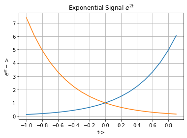
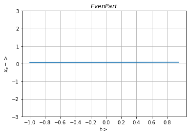
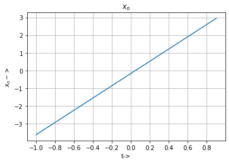
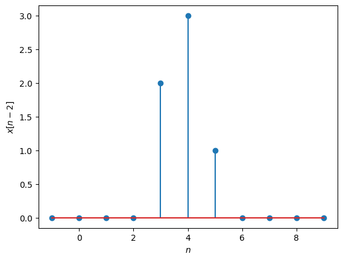
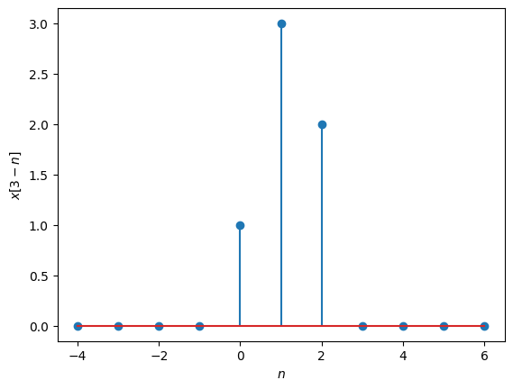

# Lab 6: 
## Aim : To perform classification of  Signals 
## Software used  : Python
## IDE : Google Colab

# Completed By
Name : Atul Kumar Dwivedi

Roll Number :11111111

Branch : Electronics and Communication Engineering

Semester : 4

Lab: Signals and Systems (BEC 451)

Date of Completion 30/03/2024
 
 

## (a) To identify even and odd signals and also even and odd parts of signal $x(t)=e^{2t}$


```python
import matplotlib.pyplot as plt
import numpy as np
# Function to generate exponential signals e**(at)
def exponential(a, t):
    expo =[]
    for sample in t:
        expo.append(np.exp(a * sample))
    return (expo)
         
a = 2
UL = 1
LL = -1
t = np.arange(LL, UL, 0.1)
x1 = exponential(a, t)
a=-2
x2 = exponential(a, t)
plt.plot(t, x1,t, x2)
plt.xlabel('t->')
plt.xticks(np.arange(LL, UL, 0.2))
# plt.yticks([0, UL, 1])
plt.ylabel('$e^{at}->$')
plt.title('Exponential Signal $e^{2t}$')
plt.grid()
if x1 == x2:
  print("This is an even signal")
elif x1!=x2:
  print("This is an odd signal")
else:
  print("Neither even nor odd")
#EVEN
xe=np.divide((x1+x2),2) #Compute the even part
print('\n Even part \n',xe)
plt.figure()
t = np.arange(LL, UL, 0.05)
plt.plot(np.take(t,[0,39]), np.take(xe,[0,39]))
plt.xlabel('t->')
plt.xticks(np.arange(LL, UL, 0.2))
plt.yticks([-3,-2,-1,0,1,2,3])
plt.ylabel('$x_e->$')
plt.title('$Even Part$')
plt.grid()
# ODD
xo=np.divide(np.subtract(x1,x2),2) #Compute the odd part
print('\n Odd Part \n', xo)
plt.figure()
t = np.arange(LL, UL, 0.1)
plt.plot(np.take(t,[0,19]), np.take(xo,[0,19]))
plt.xlabel('t->')
plt.xticks(np.arange(LL, UL, 0.2))
plt.yticks([-3,-2,-1,0,1,2,3])
plt.ylabel('$x_o->$')
plt.title('$x_o$')
plt.grid()

```

    This is an odd signal
    
     Even part 
     [0.06766764 0.08264944 0.10094826 0.12329848 0.15059711 0.18393972
     0.22466448 0.27440582 0.33516002 0.40936538 0.5        0.61070138
     0.74591235 0.9110594  1.11277046 1.35914091 1.66005846 2.02759998
     2.47651621 3.02482373 3.69452805 3.02482373 2.47651621 2.02759998
     1.66005846 1.35914091 1.11277046 0.9110594  0.74591235 0.61070138
     0.5        0.40936538 0.33516002 0.27440582 0.22466448 0.18393972
     0.15059711 0.12329848 0.10094826 0.08264944]
    
     Odd Part 
     [-3.62686041e+00 -2.94217429e+00 -2.37556795e+00 -1.90430150e+00
     -1.50946136e+00 -1.17520119e+00 -8.88105982e-01 -6.36653582e-01
     -4.10752326e-01 -2.01336003e-01 -4.44089210e-16  2.01336003e-01
      4.10752326e-01  6.36653582e-01  8.88105982e-01  1.17520119e+00
      1.50946136e+00  1.90430150e+00  2.37556795e+00  2.94217429e+00]
    


    

    


    

    


    

    


## (b) Classification of Signals 


```python
import numpy as np
import matplotlib.pyplot as plt

def is_periodic(samples, value, tolerance=0):
    diffs = [a-b for a, b in zip(samples, samples[1:])]
    return all(d-tolerance <= value <= d+tolerance for d in diffs)


n=np.linspace(-3,7,11)
x=np.array([0,0,0,0,2,3,1,0,0,0,0])
x1=3*x
Shift1=2;
Shift2=3;

#print x1
plt.figure(1)
plt.stem(n,x)
plt.xlabel('$n$')
plt.ylabel('$x[n]$')
#print x2
plt.figure(2)
plt.stem(n,x1)
plt.xlabel('$n$')
plt.ylabel('$3*x[n]$')

plt.figure(3)
plt.stem(n+Shift1,x)
plt.xlabel('$n$')
plt.ylabel('$x[n-2]$')

plt.figure(4)
plt.stem(Shift2-n,x)
plt.xlabel('$n$')
plt.ylabel('$x[3-n]$')

E=0
for i in range (-3,6):
    E+=(x[i]**2)

print ('x[n] is eneregy signal')
print (E)

C=0
for i in range (-3,0):
    if x[i]==0:
        C=C+1
if C==3:
    print ('x[n] is causal')

p=0
for i in range(1,10):
    X=is_periodic(x,i,1)
    if X==True:
        print ('x(t) is periodic')
        p=p+1

if (X==False and p==0):
    print ('x(t) is aperiodic signal')

plt.show()
```

    x[n] is eneregy signal
    13
    x[n] is causal
    x(t) is aperiodic signal
    


    

    


    

    


    

    


    

    


```python

```
