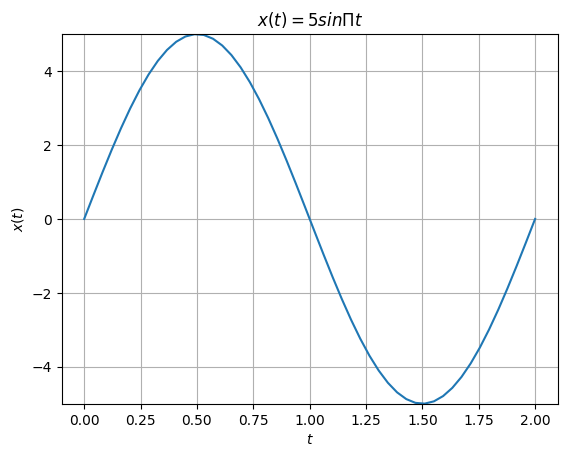
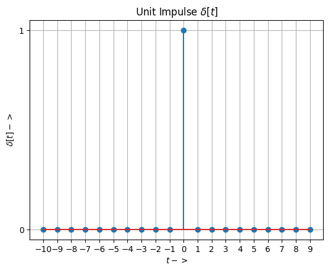
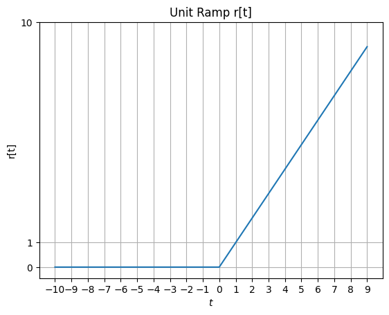

# Lab 2_1 :Signals and systems
## Course Co-cordinator : Dr. Atul Kumar Dwivedi
## Aim : To generate and visualize Elementry Signals in Continuous time
## Software used  : Python
## IDE : Google Colab 
## Libraries used : Numpy, Matplotlib
### Completed By
**Student Name** : 
**Roll Number** :
Branch : Electronics and Communication Engineering

Semester : 4

Lab: Signals and Systems (BEC 451)

Date of Completion .......


### program 1 : To generate and visualize a continuous time sinusoidal Signal
### $x(t)= 5sinΠ t$ in 0≤t≤2


```python
#importing required libraries
import numpy as np
import matplotlib.pyplot as plt
#generating time for function calculation
t=np.linspace(0,2,50)
x=5*np.sin(np.pi*t);
#plotting the generated values
plt.plot(t,x)
plt.xlabel('$t$') # Label to x axis
plt.ylabel('$x(t)$') # Label to y 
plt.title('$x(t)= 5sinΠ t$')
plt.ylim((-5,5)) # Axis limit
plt.grid() # plotting grid
plt.show()
```


    

    


## Program 2 To generate and visualize Unit Impulse Signal


```python
import numpy as np
import matplotlib.pyplot as plt
UL = 10
LL = -10
t = np.arange(LL, UL, 1)
print('t=',t)
myd=[]
myd= np. concatenate((np.zeros(10), np.ones(1),np.zeros(9) ), axis=0)
print('d=',myd)
plt.stem(t, myd)
plt.xlabel('$t->$')
plt.xticks(np.arange(LL, UL, 1))
plt.yticks([0, 1])
plt.ylabel('$\delta[t]->$')
plt.title('Unit Impulse $\delta[t]$')
plt.grid();

```

    t= [-10  -9  -8  -7  -6  -5  -4  -3  -2  -1   0   1   2   3   4   5   6   7
       8   9]
    d= [0. 0. 0. 0. 0. 0. 0. 0. 0. 0. 1. 0. 0. 0. 0. 0. 0. 0. 0. 0.]
    


    

    


## Program 3 To generate and visualize Unit step Signal


```python
import numpy as np
import matplotlib.pyplot as plt
UL = 100
LL = -100
t = np.arange(LL, UL, 1)
print('t=',t)
myunit=[]
s=int(t.size/2)
myunit= np.concatenate((np.zeros(100),np.ones(100)))
print('u=',myunit)
plt.plot(t, myunit)
plt.xlabel('$t->$')
#plt.xticks(np.arange(LL, UL, 1))
#plt.yticks([0, 1])
plt.ylabel('$u[t]->$')
plt.title('Unit Step $u[t]$')
plt.grid();
```

    t= [-100  -99  -98  -97  -96  -95  -94  -93  -92  -91  -90  -89  -88  -87
      -86  -85  -84  -83  -82  -81  -80  -79  -78  -77  -76  -75  -74  -73
      -72  -71  -70  -69  -68  -67  -66  -65  -64  -63  -62  -61  -60  -59
      -58  -57  -56  -55  -54  -53  -52  -51  -50  -49  -48  -47  -46  -45
      -44  -43  -42  -41  -40  -39  -38  -37  -36  -35  -34  -33  -32  -31
      -30  -29  -28  -27  -26  -25  -24  -23  -22  -21  -20  -19  -18  -17
      -16  -15  -14  -13  -12  -11  -10   -9   -8   -7   -6   -5   -4   -3
       -2   -1    0    1    2    3    4    5    6    7    8    9   10   11
       12   13   14   15   16   17   18   19   20   21   22   23   24   25
       26   27   28   29   30   31   32   33   34   35   36   37   38   39
       40   41   42   43   44   45   46   47   48   49   50   51   52   53
       54   55   56   57   58   59   60   61   62   63   64   65   66   67
       68   69   70   71   72   73   74   75   76   77   78   79   80   81
       82   83   84   85   86   87   88   89   90   91   92   93   94   95
       96   97   98   99]
    u= [0. 0. 0. 0. 0. 0. 0. 0. 0. 0. 0. 0. 0. 0. 0. 0. 0. 0. 0. 0. 0. 0. 0. 0.
     0. 0. 0. 0. 0. 0. 0. 0. 0. 0. 0. 0. 0. 0. 0. 0. 0. 0. 0. 0. 0. 0. 0. 0.
     0. 0. 0. 0. 0. 0. 0. 0. 0. 0. 0. 0. 0. 0. 0. 0. 0. 0. 0. 0. 0. 0. 0. 0.
     0. 0. 0. 0. 0. 0. 0. 0. 0. 0. 0. 0. 0. 0. 0. 0. 0. 0. 0. 0. 0. 0. 0. 0.
     0. 0. 0. 0. 1. 1. 1. 1. 1. 1. 1. 1. 1. 1. 1. 1. 1. 1. 1. 1. 1. 1. 1. 1.
     1. 1. 1. 1. 1. 1. 1. 1. 1. 1. 1. 1. 1. 1. 1. 1. 1. 1. 1. 1. 1. 1. 1. 1.
     1. 1. 1. 1. 1. 1. 1. 1. 1. 1. 1. 1. 1. 1. 1. 1. 1. 1. 1. 1. 1. 1. 1. 1.
     1. 1. 1. 1. 1. 1. 1. 1. 1. 1. 1. 1. 1. 1. 1. 1. 1. 1. 1. 1. 1. 1. 1. 1.
     1. 1. 1. 1. 1. 1. 1. 1.]
    


    

    


## Program 4 : To generate and visualize unit ramp signal

## $r(t)=t$ for t>=0

## $r(t)=0$ for t<0


```python
# Function to generate unit ramp signal r(t)
# r(t)= t for t>= 0, r(t)= 0 otherwise
def unit_ramp(n):
    ramp =[]
    for sample in n:
        if sample<0:
            ramp.append(0)
        else:
            ramp.append(sample)
    return ramp

UL = 10
LL = -10
t = np.arange(LL, UL, 1)
r = unit_ramp(t)
plt.plot(t, r)
plt.xlabel('$t$')
plt.xticks(np.arange(LL, UL, 1))
plt.yticks([0, UL, 1])
plt.ylabel('r[t]')
plt.title('Unit Ramp r[t]')
#plt.savefig("UnitRamp.png")
plt.grid()

```


    

    


## Program 5 : To generate and visualize Exponential signal
## $e^{at}$


```python
import matplotlib.pyplot as plt
import numpy as np
# Function to generate exponential signals e**(at)
def exponential(a, t):
    expo =[]
    for sample in t:
        expo.append(np.exp(a * sample))
    return (expo)

a = 2
UL = 1
LL = -1
t = np.arange(LL, UL, 0.1)
x = exponential(a, t)
plt.plot(t, x)
plt.xlabel('t->')
plt.xticks(np.arange(LL, UL, 0.2))
# plt.yticks([0, UL, 1])
plt.ylabel('$e^{at}->$')
plt.title('Exponential Signal $e^{at}$')
#plt.savefig("Exponential.png")
plt.grid()
```


    

    


## Program 6 : To generate and visualize sinc signal
## $ Sinc(t) $


```python
# Importing Required Libraries
import numpy as np
import matplotlib.pyplot as plt

# Generating time data using arange function from numpy
time = np.arange(-2 * np.pi, 2 * np.pi, 0.01)

# Finding amplitude at each time using np.sinc function
amplitude = np.sinc(time)

# Plotting time vs amplitude using plot function from pyplot
plt.plot(time, amplitude)

# Setting title for the plot in blue color
plt.title('Sinc Function', color='b')

# Setting x axis label for the plot
plt.xlabel('Time' + r'$\rightarrow$')

# Setting y axis label for the plot
plt.ylabel('Sinc (time)' + r'$\rightarrow$')

# Showing grid
plt.grid()

# Highlighting axis at x=0 and y=0
plt.axhline(y=0, color='k')
plt.axvline(x=0, color='k')

# Finally displaying the plot
plt.show()
```


    

    


## Program 7 : To generate and visualize Parabolic signal


```python
import numpy as np
import matplotlib.pyplot as plt

# Define the function π(t/2)
def pi_function(t):
    return ((t*t) / 2)

# Generate time values
t_val = np.linspace(-10, 10, 100)  # Adjust the range and step size as needed

# Compute the corresponding π(t/2) values
f_val = pi_function(t_val)

# Create the plot
plt.figure(figsize=(8, 6))
plt.plot(t_val, f_val, label="$par(t)$", color="blue")
plt.xlabel("Time (t)")
plt.ylabel(r"$par(t)$")
plt.title("Plot of Unit Parabolic ")
plt.grid(True)
plt.legend()
plt.show()
```


    

    


```python

```


```python

```
