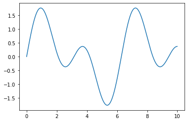
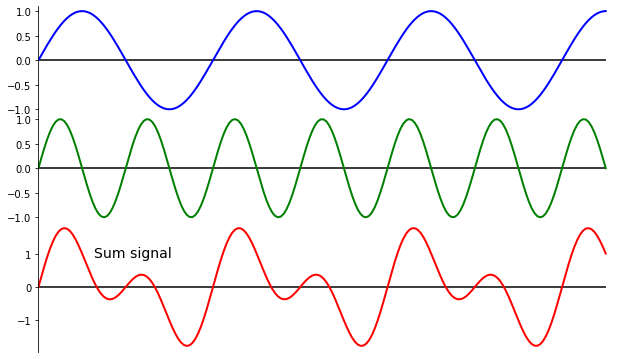
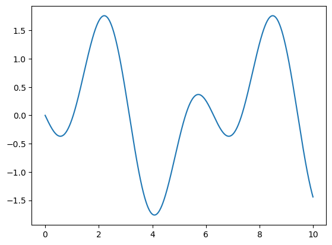
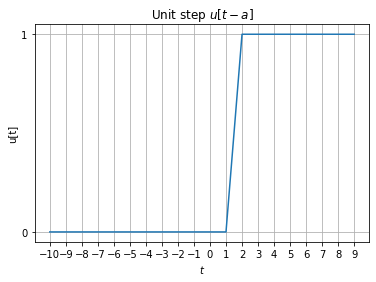
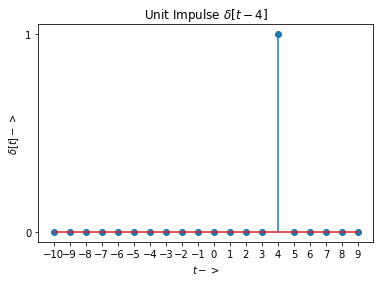
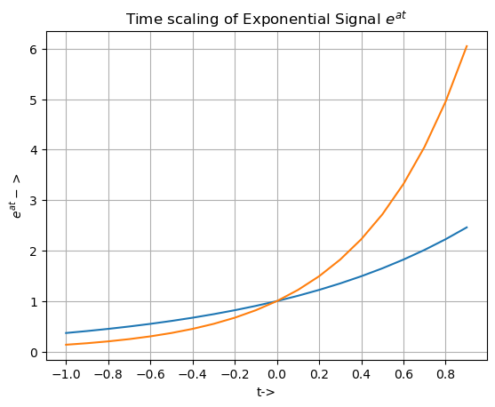
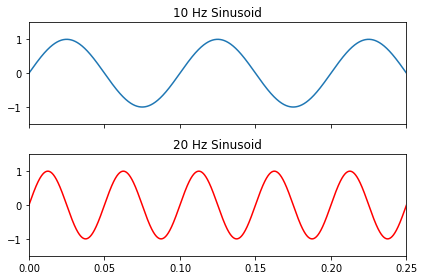
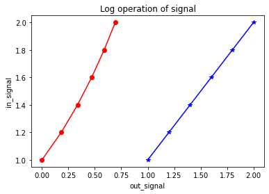

# Experiment 3 :
## Aim : To perform Basic Operations on Continuous time Signals
## Software used  : Python
## IDE : Google Colab

# Completed By
Name : Atul Kumar Dwivedi

Roll Number :11111111

Branch : Electronics and Communication Engineering

Semester : 4

Lab: Signals and Systems (KEC 451)

Date of Completion 15/02/2023


# Experiment 3.1 : To perform addition of two continuous time sinusoidal Signal
 $x_1(t)= sinΠ t$ in 0≤t≤2

  $x_2(t)= sin50Π t$ in 0≤t≤2


```python
import matplotlib.pyplot as plt
import numpy as np

x = np.arange(0,10,0.01)
x2 = np.arange(0,20,0.02)

sin1 = np.sin(x)
sin2 = np.sin(x2)

x2 /= 2

sin3 = sin1+sin2

plt.plot(x,sin3)
plt.show()
```


    

    


```python
import numpy as np
import matplotlib.pyplot as plt
left, width = 0.1, 0.8
rect1 = [left, 0.65, width, 0.25]  # left, bottom, width, height
rect2 = [left, 0.4, width, 0.25]
rect3 = [left, 0.1, width, 0.3]

fig = plt.figure(figsize=(10, 6))

ax1 = fig.add_axes(rect1)
ax2 = fig.add_axes(rect2, sharex=ax1)
ax3 = fig.add_axes(rect3, sharex=ax1)

x = np.linspace(0, 6.5*np.pi, 200)
y1 = np.sin(x)
y2 = np.sin(2*x)

ax1.plot(x, y1, color='b', lw=2)
ax2.plot(x, y2, color='g', lw=2)
ax3.plot(x, y1+y2, color='r', lw=2)

ax3.get_xaxis().set_ticks([])

for ax in [ax1, ax2, ax3]:
    ax.hlines(0, 0, 6.5*np.pi, color='black')
    for key in ['right', 'top', 'bottom']:
        ax.spines[key].set_visible(False)

plt.xlim(0, 6.6*np.pi)
ax3.text(2, 0.9, 'Sum signal', fontsize=14)
```


    Text(2, 0.9, 'Sum signal')


    

    


# Experiment 3.2 To visualize subtraction of two signals


```python
import matplotlib.pyplot as plt
import numpy as np

x = np.arange(0,10,0.01)
x2 = np.arange(0,20,0.02)

sin1 = np.sin(x)
sin2 = np.sin(x2)

x2 /= 2

sin3 = sin1-sin2

plt.plot(x,sin3)
plt.show()
```


    

    


#Experiment 3.3 To visualize time shifting of a unit step signal


```python
# function to generate unit step u[t-a]
# LL and UL are lower and upper limits of discrete time line
def unit_step(a, t):
    unit =[]
    for sample in t:
        if sample<a:
            unit.append(0)
        else:
            unit.append(1)
    return(unit)

# plot unit step function u[t-a]
a = 2 # Enter delay or advance
UL = 10
LL = -10
t = np.arange(LL, UL, 1)
unit = unit_step(a, t)
plt.plot(t, unit)
plt.xlabel('$t$')
plt.xticks(np.arange(LL, UL, 1))
plt.yticks([0, 1])
plt.ylabel('u[t]')
plt.title('Unit step $u[t-a]$')
#plt.savefig('UnitStep.png')
plt.grid()
```


    

    


# Experiment 3.4 To generate and visualize time shifting of unit impulse signal
$\delta[t]$


```python
# Function to plot Impulse signal $\delta[t]$
def unit_impulse(a, t):
    delta =[]
    for sample in t:
        if sample == a:
            delta.append(1)
        else:
            delta.append(0)
    return delta

a = 4 # Enter delay or advance
UL = 10
LL = -10
n = np.arange(LL, UL, 1)
d = unit_impulse(a, t)
plt.stem(t, d)
plt.xlabel('$t->$')
plt.xticks(np.arange(LL, UL, 1))
plt.yticks([0, 1])
plt.ylabel('$\delta[t]->$')
plt.title('Unit Impulse $\delta[t-4]$')
#plt.savefig("UnitImpulse.png")
```

    <ipython-input-5-90fac7cc70d0>:16: UserWarning: In Matplotlib 3.3 individual lines on a stem plot will be added as a LineCollection instead of individual lines. This significantly improves the performance of a stem plot. To remove this warning and switch to the new behaviour, set the "use_line_collection" keyword argument to True.
      plt.stem(t, d)
    


    Text(0.5, 1.0, 'Unit Impulse $\\delta[t-4]$')


    

    


# Experiment 3.5 : To visualize time scaling of exponential signal $e^{at}$


```python
import matplotlib.pyplot as plt
import numpy as np
# Function to generate exponential signals e**(at)
def exponential(a, t):
    expo =[]
    for sample in t:
        expo.append(np.exp(a * sample))
    return (expo)

a = 1
UL = 1
LL = -1
t = np.arange(LL, UL, 0.1)
x1 = exponential(a, t)
a=2
x2 = exponential(a, t)
plt.plot(t, x1,t, x2)
plt.xlabel('t->')
plt.xticks(np.arange(LL, UL, 0.2))
# plt.yticks([0, UL, 1])
plt.ylabel('$e^{at}->$')
plt.title('Time scaling of Exponential Signal $e^{at}$')
#plt.savefig("Exponential.png")
plt.grid()
```


    

    


# Experiment 3.6 : To visualize frequency scaling of sinusoidal signals


```python
#from scipy import signal
import numpy as np
import matplotlib.pyplot as plt

# Create figure with 2 subplots. 2 rows and 1 coloumn
fig, (ax1, ax2) = plt.subplots(2, 1, sharex=True)

# Sample rate of the periodic signal we will generate
Fs = 48000

# Time duration of the signals
t = np.linspace(0, 0.25, Fs , False)  # 1/4 second

# Generate signal with 10 and 20 Hz frequency
sig1 = np.sin(2*np.pi*10*t)
sig2 = np.sin(2*np.pi*20*t)

# Plot the 10Hz signal in first subplot using default color line
ax1.plot(t, sig1)
ax1.set_title('10 Hz Sinusoid')
ax1.axis([0, 0.25, -1.5, 1.5])

# Plot the 20Hz signal in second subplot using red color line
ax2.plot(t, sig2, 'r')
ax2.set_title('20 Hz Sinusoid')
ax2.axis([0, 0.25, -1.5, 1.5])

plt.tight_layout()

plt.show()
```


    

    


# Experiment 3.7 : To visualize log operation of signals


```python
import numpy as np
import matplotlib.pyplot as plt

in_signal = [1, 1.2, 1.4, 1.6, 1.8, 2]
out_signal = np.log(in_signal)

print ("out_signal : ", out_signal)

plt.plot(in_signal, in_signal,
         color = 'blue', marker = "*")

# red for numpy.log()
plt.plot(out_signal, in_signal,
         color = 'red', marker = "o")

plt.title("Log operation of signal")
plt.xlabel("out_signal")
plt.ylabel("in_signal")
plt.show()
```

    out_signal :  [0.         0.18232156 0.33647224 0.47000363 0.58778666 0.69314718]
    


    

    

